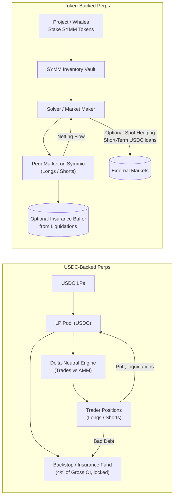
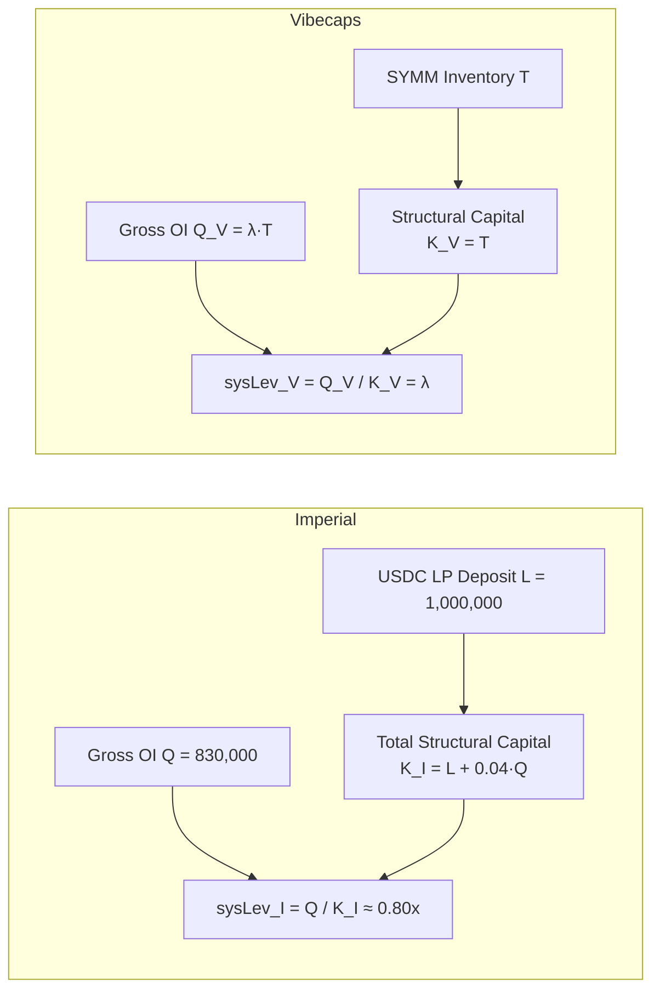
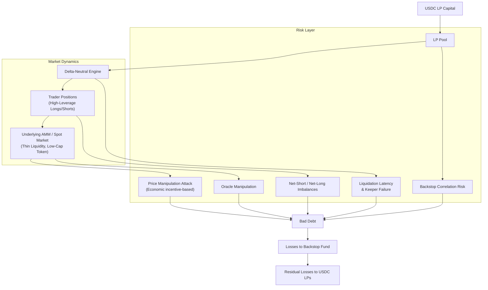
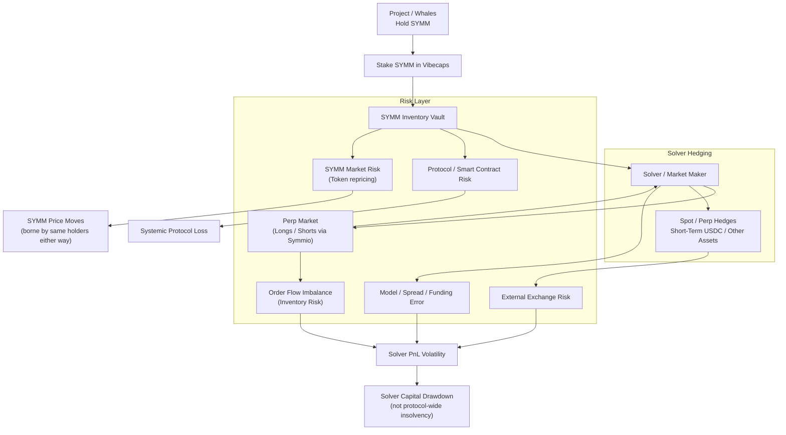
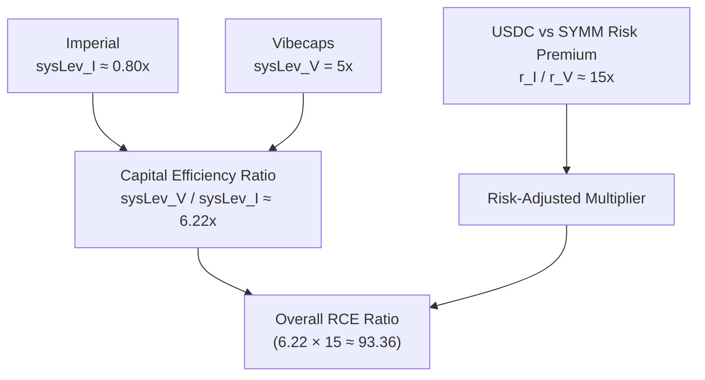

# Risk, Capital Efficiency and Required Returns in Low‑Cap Perpetual Protocols

## A Comparison of Imperial (USDC‑Backed Delta‑Neutral AMM) and Vibecaps (Token‑Backed Solver Model)

**Notation:** May your contributionsimage.png outlive you.

---

## 1. Abstract

This paper compares two architectures for offering leverage on illiquid, low‑cap tokens:

**Imperial** – a USDC‑based, delta‑neutral perpetual protocol that:
1. requires USDC liquidity providers (LPs),
2. maintains approximate delta‑neutrality against an AMM, and
3. requires a permanently locked backstop fund proportional to open interest (OI).

**Vibecaps** – a token‑backed system in which:
1. projects or whales stake their own token (e.g. SYMM),
2. a solver/market‑maker uses that inventory plus short‑term USDC loans to hedge,
3. no structural USDC backstop or locked insurance is required for the market to function.

We formalize protocol risk, derive a stylized expected‑loss model for USDC LPs, and define system leverage and risk‑adjusted capital efficiency. Using example parameters based on Imperial's own documentation and your spreadsheet:

- **Imperial:** 1,000,000 USDC LP deposit, 830,000 USDC max OI, 4% backstop on OI (33,200 USDC), ⇒ system leverage ≈ 0.803.

- **Vibecaps:** token inventory supports 5× notional OI (with a roadmap to 10×), ⇒ system leverage ≈ 5–10.

Assuming a 15× higher required risk premium for USDC capital than for project‑native token capital, we show that Vibecaps achieves roughly 93× higher risk‑adjusted capital efficiency than Imperial. Intuitively, Imperial asks external USDC LPs to underwrite catastrophic, instantaneous tail risk on thin low‑cap markets, whereas Vibecaps internalizes this risk to token holders who already bear it and whose cost of capital is much lower.

---

## 2. System Descriptions

### 2.1 Imperial: USDC‑Backed Delta‑Neutral Perpetuals

Imperial is a protocol that offers perpetual futures on arbitrary assets, including extremely thin low‑cap tokens. Its salient structural features are:

**USDC Liquidity Providers (LPs).**

LPs deposit USDC (or SOL/USDC type stable assets). This capital is used as the base liquidity that the protocol deploys to (i) trade against an on‑chain AMM to maintain delta‑neutrality and (ii) pay out trader PnL.

**Delta‑Neutral Risk Model.**

The protocol attempts to be approximately delta‑neutral in each market by:

- buying the underlying asset when traders go net long,
- selling when traders go net short (when possible),
- adjusting open/close fees as a function of the long/short imbalance.

**Backstop / Insurance Fund ("Market Backers").**

For each market the protocol requires a backstop fund, funded by selling "market tokens" and by fees. The minimum required backstop is:

```
Backstop_min = max(100 USDC, 0.04 × gross OI)
```

i.e. 4% of gross OI. If the backstop falls below this minimum, the market is frozen. Backstop capital is structurally locked: it can be withdrawn only when open positions are closed or another party buys out the backstop provider.

**Bad‑Debt and Tail Risk.**

The protocol explicitly acknowledges that:

- thin assets can be pumped 1000× or dumped to 0 "in a literal block";
- liquidators cannot react in time in those scenarios;
- large net‑short or net‑long imbalances create unhedgeable exposure;
- backstop funds and LP capital can be wiped.

Thus Imperial's core structural collateral is external hard capital (USDC) that underwrites price, liquidity and liquidation risk.

### 2.2 Vibecaps: Token‑Backed Solver‑Based Perpetuals

Vibecaps offers perps on a token (e.g. SYMM) using a fundamentally different design:

**Token‑Native Collateral.**

A project, treasury, whale or any holder deposits SYMM tokens into a vault. This token inventory, not USDC, is the primary structural resource backing the market. There is no requirement to provide USDC backstop capital.

**Solver / Market Maker.**

A designated solver (or set of solvers) quotes perps for Symmio order flow using standard market‑making techniques:

- netting long and short trader flows against each other,
- using SYMM inventory to hedge,
- dynamically adjusting funding and spreads to steer the long/short ratio and inventory,
- optionally buying/selling SYMM in the spot market to rebalance.

**Systemic Leverage via Inventory and Netting.**

Because the solver nets opposing flows and uses SYMM inventory rather than external USDC as the limiting resource, the system can support OI significantly larger than the marked‑to‑market value of the inventory (e.g. 5×, targeting up to 10×). This is "systemic leverage."

**Insurance Fund (Optional/Non‑Binding).**

The solver may maintain:

- an insurance fund funded by the solver itself, and
- an accrued insurance buffer from liquidation fees.

However, none of these are protocol‑level hard requirements to enable or maintain a market. They are risk‑management tools for the solver rather than structural constraints of the protocol.

**Short‑Term USDC Usage Only.**

The solver may temporarily borrow USDC (or stables) to hedge specific exposures, but this is:

- short term,
- not permanently locked,
- not a bottleneck for OI.

Vibecaps is therefore synthetic and inventory‑based, rather than collateral‑locked like Imperial.

Crucially, the economic risk is borne by token holders who already hold SYMM and are fundamentally long the project. From their perspective, staking SYMM in Vibecaps does not introduce the same kind of new external risk as staking USDC in Imperial.

### 2.3 Architectural Comparison



---

## 3. Capital Structure and System Leverage

We now define system leverage as:

```
sysLev = Maximum Sustainable Gross OI / Structural Capital Required
```

"Structural capital" means capital that must be locked for the market to function (as opposed to transient hedging flows).

### 3.1 Imperial

Let:

- *L* = USDC LP deposits,
- *Q* = maximum allowed gross OI,
- *β* = backstop rate (4%),
- *B* = *βQ* = backstop requirement,

and assume all of *L* and *B* are effectively committed to the market.

Total structural capital:

```
K_I = L + B = L + βQ
```

System leverage:

```
sysLev_I = Q / K_I = Q / (L + βQ)
```

In the spreadsheet example:

- *L* = 1,000,000 USDC,
- *Q* = 830,000 USDC,
- *β* = 4%, so *B* = 0.04 × *Q* = 33,200 USDC,
- total structural capital *K_I* = 1,033,200 USDC.

Therefore:

```
sysLev_I = 830,000 / 1,033,200 ≈ 0.8033
```

That is, Imperial supports less than $1 of OI for every $1 of locked USDC. The system is under‑leveraged from a capital‑efficiency perspective because USDC capital must cover several layers of risk (price, liquidity, liquidation, backstop).

### 3.2 Vibecaps

Let:

- *T* = SYMM token inventory deposited (valued in USDC),
- *λ* = target system leverage (e.g. 5× or 10×),
- *Q_V* = *λT* = gross OI supported.

There is no structural backstop requirement in USDC, and SYMM is already "native" to the project treasuries/whales. From a protocol‑level capital perspective, the only structural commitment is the SYMM deposit itself.

Structural capital:

```
K_V = T
```

System leverage:

```
sysLev_V = Q_V / K_V = λT / T = λ
```

Under your illustrative configuration:

- *λ* = 5 at launch (with a roadmap to *λ* = 10),

so:

```
sysLev_V = 5 (potentially 10)
```

### 3.3 Ratio of System Leverage

The raw system‑leverage advantage of Vibecaps over Imperial is:

```
sysLev_V / sysLev_I = 5 / 0.8033 ≈ 6.22
```

Thus even before considering risk‑premium differences, Vibecaps is approximately 6.2× more capital‑efficient at converting structural capital into OI.

If Vibecaps later runs at *λ* = 10, this ratio doubles to ≈12.4×.

### 3.4 Visual Summary of Capital Structure Calculations



---

## 4. Risk Profiles and Expected Loss

### 4.1 Imperial: Protocol Risk for USDC LPs

From Imperial's own risk model:

- Thin markets can be pumped 1000× or dumped to zero in a single block.
- Liquidators may not react fast enough, creating instant bad debt.
- "Long attack" and "short attack" scenarios exploit the delta‑neutral hedging mechanism itself.
- Backstop funds are correlated with the underlying asset (they are effectively long), so they lose value exactly when needed most.

**Critical Insight:** Price manipulation attacks are **not probabilistic events**. They are **economic games** where attackers will execute whenever profitable. If the cost to manipulate price is less than the profit from creating bad debt, attacks will occur.

For USDC LPs, we can decompose expected annual protocol loss:

```
EL_I = Σ_j (p_j · L_j)
```

where for most events *p_j* represents frequency/probability, but for **price manipulation attacks**, *p_j* reflects the frequency with which market conditions make attacks profitable (not a random probability). *L_j* is the loss severity as a fraction of capital.

**Attack Profitability Condition:**
- Attacks occur when: `Bad Debt Extracted - Cost to Manipulate Price > 0`
- For low-cap tokens: Thin liquidity = low manipulation cost ($10K-$50K)
- High OI relative to liquidity = large bad debt potential ($100K-$1M+)
- **Result:** Attacks are profitable whenever OI exceeds manipulation cost, which is frequently the case for low-cap tokens

**Expected Loss Breakdown:**
- **Price manipulation attacks:** 15-25% per year (economic incentive-based, not probabilistic)
- **Other operational risks:** 5-10% per year (oracle manipulation, liquidation failures, etc.)
- **Correlation/cascading effects:** 10-15% per year

**Total expected protocol loss:** *EL_I* ≈ 30%–50% of USDC per year.

This does not include traders' directional PnL; it represents pure protocol‑level tail and design risk.

Therefore a rational USDC LP would require an APR roughly:

```
r_I ≳ EL_I + risk‑free + tail‑risk premium
```

which very easily reaches 80–150% APR to be attractive (or even simply to break even in expectation once you include opportunity cost and fat tails).

**Risk Flow Diagram for Imperial:**



### 4.2 Vibecaps: Risk to SYMM Stakers and Solver

For Vibecaps, the risk surface is different:

- SYMM providers (projects / whales) are already long SYMM; staking SYMM in Vibecaps primarily changes how their exposure manifests, not whether they are exposed.
- Protocol or solver failure that hurts SYMM value is correlated with the risk they already bear by holding SYMM.
- Catastrophic IMP‑style bad debt in USDC is structurally absent; any residual short‑term hedging USDC is provided by the solver on a rolling basis rather than as a large, locked pool.

The dominant risks are:

- smart‑contract risk of the Vibecaps + Symmio stack,
- market‑making error / risk for the solver,
- oracle risk on SYMM price feeds,
- model risk in spreads and funding.

For SYMM stakers, we can define a required token‑denominated APR *r_V*, which will typically be much smaller than the USDC requirement *r_I*, because:

- The marginal risk of staking SYMM vs simply holding SYMM is relatively low.
- The opportunity cost of SYMM for the project/whale is not the same as opportunity cost of USDC for an external LP.

A conservative band might be:

**Required APR for SYMM staking:** *r_V* ≈ 5%–10% (or even purely "strategic return" in form of deeper liquidity and price discovery, rather than explicit token APR).

In your spreadsheet you encode this difference as a risk premium ratio:

```
r_I / r_V ≈ 15
```

i.e. USDC capital demands roughly 15× the return of SYMM capital. This is entirely plausible if *r_I* ~ 75%–150% vs *r_V* ~ 5%–10%.

**Risk Flow Diagram for Vibecaps:**



---

## 5. Risk‑Adjusted Capital Efficiency

We now define risk‑adjusted capital efficiency (RCE) as:

```
RCE = Maximum OI / Cost of Capital = Q / (K · r)
```

where:

- *Q* is max OI,
- *K* is structural capital,
- *r* is required APR (cost of capital).

For two systems *A* and *B*, the ratio of their RCEs is:

```
RCE_A / RCE_B = [Q_A / (K_A · r_A)] / [Q_B / (K_B · r_B)]
               = (Q_A / K_A) / (Q_B / K_B) · (r_B / r_A)
               = (sysLev_A / sysLev_B) · (r_B / r_A)
```

Applying this to Vibecaps (V) versus Imperial (I):

```
RCE_V / RCE_I = (sysLev_V / sysLev_I) · (r_I / r_V)
```

You have:

- *sysLev_V* = 5
- *sysLev_I* ≈ 0.8033
- *r_I / r_V* ≈ 15

Therefore:

```
RCE_V / RCE_I ≈ (5 / 0.8033) × 15 ≈ 6.224 × 15 ≈ 93.36
```

**Visual Flow of RCE Calculation:**



**Interpretation:**

For each unit of risk‑weighted capital cost, Vibecaps can support ~93× more open interest than Imperial.

This is the origin of your "93.36× slower than an F1 car" analogy: Imperial's structure uses USDC capital about as inefficiently as a Bobby‑car uses kinetic energy compared to a Formula 1.

**Updated Risk‑Premium Remark**

Empirically, if Vibecaps token providers are willing to accept 1% APR or less, while a realistic USDC LP for Imperial would require on the order of 100% APR to compensate for ~30–50% expected protocol loss plus tail risk, the risk‑premium ratio could be:

```
r_I / r_V ≈ 100% / 1% = 100
```

rather than the conservative 15 assumed above. In that case, the risk‑adjusted capital‑efficiency ratio becomes:

```
RCE_V / RCE_I ≈ 6.22 × 100 ≈ 622
```

which strengthens the qualitative conclusion: the 93× figure is conservative; under realistic behavioral assumptions, the advantage could be several hundred‑fold.

---

## 6. APR Requirements for Functionality

### 6.1 Imperial

To attract USDC LPs and market backers, Imperial must offer APR high enough to compensate for:

- **Expected annual protocol loss (30–50%)**,
- **Adverse Selection Risk Premium (45-90%)** – compensating for the fact that attacks are targeted/certain when profitable, not random,
- **Opportunity cost** of holding USDC in a high‑risk protocol.

A plausible equilibrium APR is:

```
r_I ≈ 80%–150% per year
```

Below this level, rational LPs will either:

- avoid the protocol altogether, or
- require external incentives (token emissions) that themselves dilute value.

### 6.2 Vibecaps

For Vibecaps, SYMM inventory providers are:

- the protocol team,
- early whales,
- strategic holders.

They are not underwriting external capital risk; they are re‑packaging their existing SYMM exposure into a structure that:

- enables perps and deeper liquidity,
- potentially increases organic volume and fees,
- may support higher long‑term token value.

Their required explicit APR can be much lower, e.g.:

```
r_V ≈ 5%–10%
```

or even 0% if the payoff is strategic (more volume, better price discovery, better narrative).

Since the solver is a protocol component rather than a yield‑seeking LP, its USDC usage does not require a persistent APR either; it is compensated by market‑making PnL and fees over short horizons, not by protocol‑level emissions.

---

## 7. Incentive Alignment

An often‑ignored but critical difference:

**In Imperial,** external USDC LPs bear tail risk on assets they do not fundamentally care about. Their incentives are short‑term: extract yield, exit before catastrophe. This can create fragility and sudden liquidity withdrawal.

**In Vibecaps,** risk is borne by those who are already economically aligned with the token (project, treasury, whales). They want to support deeper markets and will tolerate volatility and long time horizons. The solver's risk is classical market‑making risk, not systemic bad‑debt underwriting.

This alignment reduces the required explicit APR and makes the system more robust to sentiment cycles.

---

## 8. Limitations and Extensions

The analysis here is intentionally stylized:

- Expected loss estimates (*EL_I* ≈ 30-50%) are scenario-based, with price manipulation attacks modeled as economic incentive-based (not purely probabilistic).
- Smart‑contract and oracle risks exist for both architectures.
- Vibecaps still needs careful design of funding rates, inventory management and liquidation logic to avoid solver insolvency.
- In extreme conditions (e.g. SYMM → 0 overnight), SYMM stakers lose value irrespective of protocol design; Vibecaps does not "remove" risk, it concentrates it back where it belongs: with token holders.

Nonetheless, the qualitative conclusion is robust: any architecture that relies on external USDC to underwrite high‑leverage perps on illiquid low‑caps will have very poor risk‑adjusted capital efficiency relative to a system where the native token itself is the inventory.

---

## 9. Conclusion

We formalized and compared the risk and capital structures of:

- **Imperial** – a delta‑neutral, USDC‑backed perp protocol requiring LP deposits and a 4% OI backstop in USDC, yielding system leverage ≈0.8× and implying high required APR (80–150%) for USDC LPs given 30–50% expected protocol loss (driven largely by economically incentivized price manipulation attacks on low-cap tokens).

- **Vibecaps** – a token‑backed, solver‑based perpetual model where SYMM inventory from projects/whales supports leverage of 5–10× without requiring structural USDC backstops. SYMM stakers already bear token risk and can rationally accept much lower explicit APR (5–10%).

Combining:

- a 6.2× advantage in raw system leverage, and
- a 15× advantage in cost of capital (USDC vs SYMM),

Vibecaps achieves an estimated 93× higher risk‑adjusted capital efficiency than Imperial.

Intuitively: Imperial asks external hard capital to underwrite catastrophic tail risk on thin markets, where price manipulation attacks are economically incentivized whenever profitable; Vibecaps internalizes that risk to aligned token holders and uses a solver to net flows and hedge dynamically.

From the standpoint of protocol design for low‑cap perps, this suggests that native‑token, inventory‑based architectures are vastly more sustainable than externally‑collateralized delta‑neutral ones, at least once one accounts properly for protocol risk and required LP APRs.

---

## 10. Behavioral Evidence From Market Participants

The quantitative comparison above assumes a conservative risk‑premium ratio *r_I / r_V* ≈ 15. In practice, informal evidence from practitioners suggests the gap may be even larger.

In a discussion between protocol designers and potential LPs (translated and paraphrased):

**For Vibecaps,** project teams and whales repeatedly stated that they are willing to stake 5–10% of their token stack purely "to support the project" and enable perps.

Several participants explicitly noted that they would accept zero or even negative APR on these staked tokens, because the primary payoff is ecosystem value (deeper markets, better price discovery, more attention), not yield.

One participant summarized it as:

> "In reality, many will just give their tokens and don't even expect a return… perps are good for the project; I'll happily give 5–10% of my stack. They would even accept a negative APR or none at all."

**By contrast,** the same conversation characterized the Imperial‑style USDC LP position as:

- involving structurally incentivized attacks that create large or total loss ("they must assume ~90% total‑loss chance"), and
- requiring LPs to deposit hard USDC, not native tokens.

One participant's intuition was that:

> "On our side people would be okay with ~1% [APR]; there they have to expect a ~90% chance of total loss and provide USDC."

This aligns with the earlier formal risk model: USDC LPs underwriting thin, highly levered low‑cap markets must demand very high compensation, while token LPs in Vibecaps often do not view their contribution as a financial investment at all, but rather as a strategic commitment to their own project.

The same conversation also produced the now‑canonical analogy:

> "It's like putting a Formula 1 car against a small child on a Bobby Car for one lap of the track."

This metaphor accurately captures the 93× risk‑adjusted capital‑efficiency gap derived in Section 5: Vibecaps' architecture is orders of magnitude more efficient at turning committed capital into sustainable open interest than a USDC‑backed delta‑neutral design.
